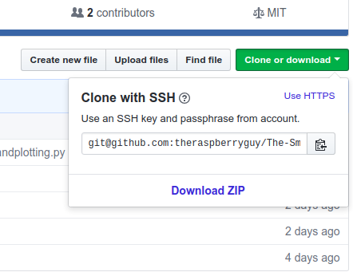
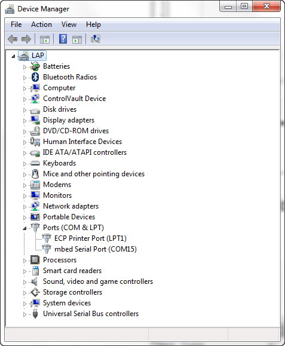

# TheSmartGlove
A school project to map the forces applied to a hand to aid physiotherapists with diagnosis.

**A project by:**

_The Hills Road Sixth Form EES Team_


# How to set up

To get the code contained in this repository, you can either download it the boring way, or use git.

## Downloading

From the drop-down _Clone or Download_ button, select **Download As ZIP**



Find a folder to download the zip into, and unzip by right-clicking and selecting _'unzip"_

## Cloning Using Git

Cloning is the beneficial because it makes it easier to update your copies of the files
to keep them up to date with the repository.

To clone using git, create the folder where you want to store the files. Hold down shift and right-click on the folder and select **Open Command Window Here**.

Paste in the following line:

```sh
git clone https://github.com/theraspberryguy/The-SmartGlove.git
```

If this doesn't work (E.g git is not a recognised batch file etc...), you don't have git installed.
Either just give up and download manually, or follow a nice tutorial to install it [here](https://www.atlassian.com/git/tutorials/install-git#windows)


# Using the code


There are 3 functional programs currently on the repository:

1. NewThreading.py
   - This uses serial rather than bluetooth, and simply plots a graph of two incoming data values.
2. mainBluetooth.py
   - This does the same thing NewThreading.py does, except with bluetooth functionality. 
3. handplotting.py
   - This uses incoming serial data to change the color of two circles placed on an image of a hand.
   
**N.B** handplotting.py and NewThreading.py are run in the same way.

## NewThreading.py and handplotting.py

Both of these need two command line options: **port** (The serial port) and **baudrate** (Set to 9600 for now).

They both have one optional option, **length**, which specifies the length of the data to plot.

> In NewThreading.py, length changes the number of points plotted.

> In handplotting.py, it has no effect, so can be set to 1.

An example command to run them is:

```sh
python3 NewThreading.py --port COM3 --baud 9600 --len 100
```

If the serial port cannot be found, the device is in a different serial port. 
To find which one it is in, open Device Manager (Control Panel -> Device Manager), and look under _Ports (COM and LPT)_



Interchange the port in the command line for the port specified under device manager (in this case COM15):

```sh
python3 NewThreading.py --port COM15 --baud 9600 --len 100
```

You should also make sure you are in the directory the files are in. If _NewThreading.py_ could not be found, then open a command prompt at the folder using file explorer.

## mainBluetooth.py

Watch This Space

# Updating Your Version Of Code

If you are not using git, you will have to re-download the repository.

With git, open the command prompt at your folder and use:

```sh
git pull
```
It may take a minute, but your files will be up to date.

**N.B** This will delete all the changes you have made to the files. To prevent this, you could either make a separate local copy, or use git branching.
